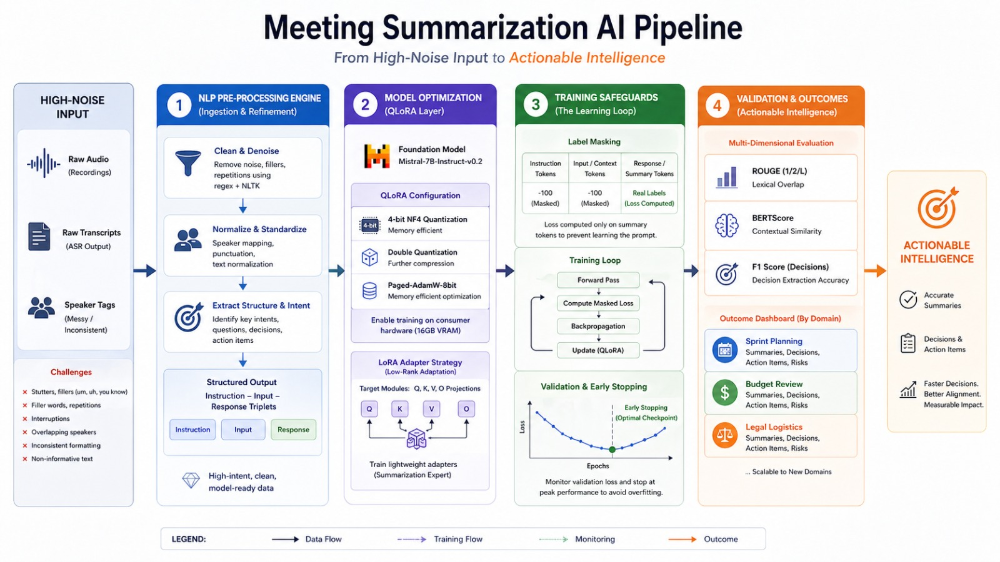

# 🎙️ Mistral-7B Meeting Intelligence Pipeline

A state-of-the-art, end-to-end NLP pipeline for transforming noisy human conversations into structured, actionable business intelligence. This project utilizes **Mistral-7B-Instruct-v0.2** fine-tuned via **QLoRA** (Quantized Low-Rank Adaptation) to handle real-world meeting transcripts with high precision.   
---

## 🚀 Key Features

*   **Noise-Resilient Processing**: Specialized cleaning scripts  (`clean_data.py`) to strip filler words, stutters, and messy speaker tagging.
*   **Memory-Efficient Fine-Tuning**: Implementation of 4-bit NF4 Quantization and Double Quantization, allowing 7B models to train on a single 16GB GPU (Kaggle T4).
*   **Scientific Validation**: Multi-metric evaluation suite including **ROUGE-L**, **BERTScore**, and **Action Item F1**.
*   **Interactive Analytics Dashboard**: A premium, interactive UI (`dashboard.html`) for visualizing architecture, learning curves, and real-time model comparisons.
*   **Overfitting Safeguards**: Integrated Early Stopping and Label Masking logic to ensure high generalization performance.

---

## 🏗️ System Architecture



The pipeline is organized into four logical stages:
1.  **Ingestion**: Loading raw meeting datasets in JSONL format.
2.  **Transformation**: Cleaning transcripts and wrapping them in specialized Instruction Templates.
3.  **Optimization**: 4-bit Quantization and LoRA Adapter training.
4.  **Validation**: Comparative inference across checkpoints (ckpt-100 to ckpt-250) vs. Zero-shot baselines.

---

## 📂 Repository Structure

```bash
├── dashboard.html          # Premium Interactive Dashboard (Run this!)
├── pipeline.jpeg           # Visual architecture diagram
├── checkpoint_comparison.py # Comparative inference & scoring engine
├── clean_data.py           # Pre-processing & Transcript cleaning
├── training.py             # QLoRA Fine-tuning implementation
├── generate_loss_curves.py # Training & Metric visualization generator
├── outputs/
│   └── predictions/        # CSV/JSON results and performance graphs
└── artifacts/              # Detailed technical implementation guides
```

---

## 📊 Getting Started

### 1. View the Interactive Report
The easiest way to see the project's success is to open the interactive dashboard:
```bash
# Simply open dashboard.html in any modern browser
```
This dashboard allows you to zoom into the architecture, view learning curves, and swap between models to see how the fine-tuned version beats the baseline.

### 2. Run Evaluation
To regenerate the performance leaderboard and prediction files:
```bash
python checkpoint_comparison.py
```

### 3. Generate Visuals
To refresh the loss curves and ROUGE comparison charts:
```bash
python generate_loss_curves.py
```

---

## 🔬 Technical Deep Dive

For detailed explanations of the engineering choices made in this project (like **Label Masking** and **NF4 Quantization**), please refer to the specialized guides in the artifacts directory:
- [Technical Walkthrough](artifacts/walkthrough.md)
- [Training Implementation Guide](artifacts/training_implementation_guide.md)

---

## 🏆 Results
After rigorous testing, **Checkpoint 200** was identified as the optimal model. It achieves a significantly higher ROUGE-L score compared to Zero-shot baselines while maintaining strict adherence to the facts presented in the messy input transcripts.

| Model | ROUGE-L | Status |
| :--- | :--- | :--- |
| **Mistral-7B (ckpt-200)** | **15.68** | **Best (Optimal)** |
| Mistral-7B (Zero-shot) | 14.02 | Baseline |
| Mistral-7B (ckpt-100) | 12.28 | Underfit |
| Mistral-7B (ckpt-250) | 14.92 | Overfit |

